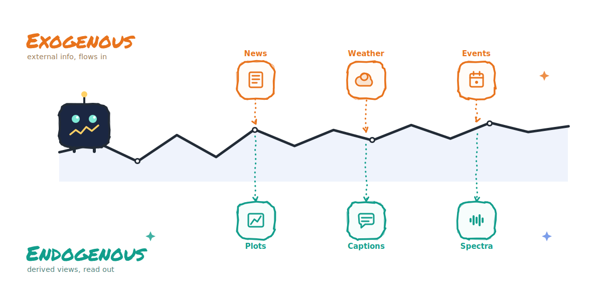

# Multimodal Time-Series Survey

<!--  -->

<!--  -->

A curated collection of papers, datasets, benchmarks, and code for multimodal time-series analysis, including forecasting, reasoning, captioning, alignment, fusion, and foundation models.

---

## Table of Contents

- [Taxonomy](#taxonomy)
- [Modality](#modality)
  - [Exogenous Modalities](#exogenous-modalities)
  - [Endogenous Modalities](#endogenous-modalities)
  - [Hybrid: Exogenous + Endogenous](#hybrid-exogenous--endogenous)
- [Task](#task)
  - [Forecasting](#forecasting)
  - [Classification](#classification)
  - [Anomaly Detection](#anomaly-detection)
  - [Imputation](#imputation)
  - [Generation](#generation)
  - [Captioning](#captioning)
  - [Reasoning / QA](#reasoning--qa)
- [Learning Paradigm](#learning-paradigm)
  - [Fusion](#fusion)
  - [Alignment](#alignment)
  - [Representation Learning](#representation-learning)
  - [Contrastive Learning](#contrastive-learning)
  - [Multitask Learning](#multitask-learning)
  - [Retrieval-Augmented Learning](#retrieval-augmented-learning)
  - [Prompting / In-Context Learning](#prompting--in-context-learning)
  - [Foundation Model Adaptation](#foundation-model-adaptation)
  - [Agentic](#agentic)
- [Datasets and Benchmarks](#datasets-and-benchmarks)
- [Surveys](#surveys)
---

## Taxonomy

This repository organizes papers from three complementary views: **Modality**, **Task**, and **Learning Paradigm**.

---

### Modality Types

Multimodal time-series papers differ in *where* their auxiliary information comes from.

**Exogenous Modalities** — Information that originates *outside* the target variable and cannot be derived from the raw TS values alone. It requires an external data source. Examples include:
- Text: news articles, clinical notes, weather reports, earnings calls, social media
- Event streams: financial announcements, IoT triggers, market microstructure data
- External images: satellite imagery, medical scans, surveillance feeds
- Relational graphs: road networks, knowledge graphs, sensor topologies
- Tabular metadata: geographic coordinates, device specifications, demographic attributes

Papers in this group study how to align, fuse, or condition TS models on external context that arrives from outside the observed signal.

**Endogenous Modalities** — Alternative representations constructed *directly from the raw time series*, without any external input. These are deterministic transformations of the TS itself. Examples include:
- Frequency / spectral: spectrograms, STFT, wavelet coefficients, power spectral density
- Visual encodings: line plots, Gramian angular fields (GAF), recurrence plots (RP), motif transition fields (MTF)
- Decomposition components: trend, seasonality, and remainder from STL or EMD
- Statistical summaries: mean, variance, autocorrelation lags, quantile sketches
- Generated descriptions: natural-language captions or statistical reports produced by an LLM from the TS values

Papers in this group explore whether reformulating a TS as a different representational modality unlocks pretrained vision or language models for TS analysis.

**Hybrid: Exogenous + Endogenous** — Papers that use *both* types simultaneously. They combine external context (e.g., domain-expert text prompts, financial news) with TS-derived representations (e.g., patched visual encodings, LLM-generated statistical descriptions) within a single model. These works often leverage pretrained multimodal models (VLMs, LLMs) and require careful alignment across all three streams: raw TS, derived representation, and external context.

---

### Task Categories

| Task | Description |
|---|---|
| **Forecasting** | Predict future TS values given historical observations and auxiliary modalities. |
| **Classification** | Assign a semantic label to a TS segment or channel (activity type, device state, disease category, etc.). |
| **Anomaly Detection** | Identify time points or intervals that deviate from expected behavior, often with multimodal context for confirmation or explanation. |
| **Imputation** | Reconstruct missing or corrupted TS observations using auxiliary representations or cross-channel dependencies. |
| **Generation** | Synthesize realistic time series from text descriptions, images, or other conditioning signals. |
| **Captioning** | Generate natural-language descriptions of a TS, capturing trends, anomalies, and periodic structure. |
| **Reasoning / QA** | Answer natural-language questions about TS data, requiring temporal reasoning, pattern interpretation, or event correlation. |

---

### Learning Paradigm Categories

| Paradigm | Description |
|---|---|
| **Fusion** | Combine representations from multiple modalities via cross-modal attention, gating, or concatenation. |
| **Alignment** | Learn a shared embedding space so that semantically related TS signals and auxiliary inputs are nearby (e.g., contrastive or matching objectives). |
| **Representation Learning** | Design TS encoders that exploit auxiliary modality structure (visual, spectral, statistical) to obtain richer latent features. |
| **Contrastive Learning** | Maximize agreement between positive cross-modal pairs and repel negative pairs to learn aligned multimodal representations. |
| **Multitask Learning** | Train a single model on multiple objectives simultaneously (e.g., forecasting + captioning) to share representations and improve generalization. |
| **Retrieval-Augmented Learning** | At inference, retrieve relevant historical TS examples and incorporate them as additional context for improved generalization. |
| **Prompting / In-Context Learning** | Condition a frozen LLM on structured prompts containing TS context to enable few-shot or zero-shot TS understanding. |
| **Foundation Model Adaptation** | Adapt large pretrained models (LLMs, ViTs, MAEs) to TS by fine-tuning, reprogramming, or zero-shot transfer. |
| **Agentic** | Equip an LLM with a set of TS analysis tools and train it to compose multi-step analytical pipelines autonomously. |

---

## Modality

### Exogenous Modalities

| Paper | Venue | Year | Note | Code |
|---|---|---:|---|---|
| [Language in the Flow of Time: Time-Series-Paired Texts Weaved into a Unified Temporal Narrative](https://arxiv.org/abs/2502.08942) | ICLR 2026 | 2026 | TaTS: treats TS-paired texts as auxiliary variables and weaves textual + numerical patterns into a unified temporal narrative | - |
| [SciTS: Scientific Time Series Understanding and Generation with LLMs](https://arxiv.org/abs/2510.03255) | ICLR 2026 | 2026 | 12-domain scientific TS benchmark (43 tasks 50K+ instances) + TimeOmni LLM framework for unified scientific TS understanding | - |
| [Semantic-Enhanced Time-Series Forecasting via Large Language Models](https://arxiv.org/abs/2508.07697) | ICLR 2026 | 2026 | SE-LLM: Temporal-Semantic Cross-Correlation module + Time-Adapter to bridge linguistic knowledge structures with TS data patterns | - |
| [TAMMs: Change Understanding and Forecasting in Satellite Image Time Series with Temporal-Aware Multimodal Models](https://arxiv.org/abs/2506.18862) | ICLR 2026 | 2026 | Temporal-aware multimodal model for change detection and forecasting in satellite image time series | - |
| [TimeOmni-1: Incentivizing Complex Reasoning with Time Series in Large Language Models](https://arxiv.org/abs/2509.24803) | ICLR 2026 | 2026 | First unified TS reasoning model with four atomic tasks: scenario understanding causality discovery event-aware forecasting decision-making | - |
| [Unlocking the Value of Text: Event-Driven Reasoning and Multi-Level Alignment for Time Series Forecasting](https://arxiv.org/abs/2603.15452) | ICLR 2026 | 2026 | Event-driven reasoning with multi-level text-TS alignment to unlock textual context value for improved forecasting | [Code](https://github.com/decisionintelligence/VoT) |
| [Giving Sensors a Voice: Multimodal JEPA for Semantic Time-Series Embeddings](https://arxiv.org/abs/2605.31580) | ICML 2026 | 2026 | Multimodal JEPA that jointly learns semantic text-grounded and temporal structure for enriched TS embeddings | - |
| [HEARTS: Benchmarking LLM Reasoning on Health Time Series](https://arxiv.org/abs/2603.06638) | ICML 2026 | 2026 | Comprehensive benchmark evaluating LLM reasoning over health TS across multiple clinical tasks and domains | - |
| [OpenTSLM: Time-Series Language Models for Reasoning over Multivariate Medical Text- and Time-Series Data](https://arxiv.org/abs/2510.02410) | ICML 2026 | 2026 | Open-source TS language model for joint reasoning over multivariate medical TS and clinical text data | - |
| [Sonar-TS: Search-Then-Verify Natural Language Querying for Time Series Databases](https://arxiv.org/abs/2602.17001) | ICML 2026 | 2026 | Search-then-verify framework for NL queries over TS databases; decomposes natural language questions into analytical sub-queries | - |
| [TSRBench: A Comprehensive Multi-task Multi-modal Time Series Reasoning Benchmark for Generalist Models](https://arxiv.org/abs/2601.18744) | ICML 2026 | 2026 | Comprehensive benchmark evaluating generalist models on multi-task multimodal TS reasoning across diverse domains | - |
| [TelecomTS: A Multi-Modal Observability Dataset for Time Series and Language Analysis](https://arxiv.org/abs/2510.06063) | ICML 2026 | 2026 | Multi-modal observability dataset pairing telecom KPI TS with natural language logs for joint TS and language analysis | [Code](https://github.com/Ali-maatouk/TelecomTS) |
| [What if Tomorrow is the World Cup Final? Counterfactual Time Series Forecasting with Textual Conditions](https://arxiv.org/abs/2605.14422) | ICML 2026 | 2026 | Counterfactual TS forecasting with textual event conditions to answer what-if questions about future trajectories | - |
| [Can LLM Coding Agents Reason About Time Series?](https://arxiv.org/abs/2606.16545) | arXiv | 2026 | Evaluates LLM coding agent capabilities for TS reasoning via tool use and code generation across diverse TS tasks | - |
| [Does Text Actually Help? Uncovering and Resolving Text Collapse in Multimodal Time Series Forecasting](https://arxiv.org/abs/2606.19413) | arXiv | 2026 | Identifies and resolves text collapse phenomenon where text modality degrades multimodal TS forecasting performance | - |
| [InstructTime++: Time Series Classification with Multimodal Language Modeling via Implicit Feature Enhancement](https://arxiv.org/abs/2601.14968) | arXiv | 2026 | Enhances TS classification with multimodal LM and implicit feature enhancement via natural language instructions | - |
| [MMTS-BENCH: A Comprehensive Benchmark for Time Series Understanding and Reasoning](https://arxiv.org/abs/2602.08588) | arXiv | 2026 | 2424 TSQA pairs across Base/InWild/Match/Align subsets; covers structural awareness;feature analysis;temporal reasoning;cross-modal alignment | - |
| [MetaboNet-Bench: A Multi-modal Benchmark for Glucose Forecasting in Type 1 Diabetes](https://arxiv.org/abs/2606.18640) | arXiv | 2026 | Multi-modal benchmark combining CGM glucose TS with diet/insulin/activity records for T1D glucose forecasting | - |
| [Nexus: An Agentic Framework for Time Series Forecasting](https://arxiv.org/abs/2605.14389) | arXiv | 2026 | Multi-agent framework decomposing forecasting into macro/micro temporal outlook agents + synthesizer; integrates news/event context for grounded TS forecasting | - |
| [Rethinking Multimodal Fusion for Time Series: Text Modalities Need Constrained Fusion](https://arxiv.org/abs/2603.22372) | arXiv | 2026 | Shows unconstrained text fusion harms TS forecasting; proposes Constrained Fusion Architecture (CFA) | [Code](https://github.com/seunghan96/cfa) |
| [TimeART: Towards Agentic Time Series Reasoning via Tool-Augmentation](https://arxiv.org/abs/2601.13653) | arXiv | 2026 | LLM agent with 21 TS analysis tools; 100k expert trajectory TimeToolBench dataset | - |
| [Towards Multimodal Time Series Anomaly Detection with Semantic Alignment and Condensed Interaction](https://arxiv.org/abs/2603.21612) | arXiv | 2026 | MindTS: fine-grained time-text semantic alignment + content condensing for anomaly detection on 6 multimodal datasets | - |
| [UPLOTS: A Unified Pretrained Language Model for Constrained Time-series Generation](https://arxiv.org/abs/2606.10466) | arXiv | 2026 | Unified pretrained LM for constrained TS generation guided by natural language constraint specifications | - |
| [CALF: Aligning LLMs for Time Series Forecasting via Cross-modal Fine-Tuning](https://arxiv.org/abs/2403.07300) | AAAI 2025 | 2025 | Cross-modal fine-tuning that aligns LLM word token distributions with TS patch representations for forecasting | [Code](https://github.com/Hank0626/LLaTA) |
| [Can LLMs Understand Time Series Anomalies?](https://arxiv.org/abs/2410.05440) | ICLR 2025 | 2025 | Systematic evaluation of LLM capabilities for TS anomaly detection via zero-shot and few-shot prompting with textual context | - |
| [Context-Alignment: Activating and Enhancing LLM Capabilities in Time Series](https://arxiv.org/abs/2501.03747) | ICLR 2025 | 2025 | Few-shot context alignment activating LLM capabilities for TS by aligning contextual descriptions with TS patch representations | [Code](https://github.com/tokaka22/ICLR25-FSCA) |
| [ITFormer: Bridging Time Series and Natural Language for Multi-Modal QA with Large-Scale Multitask Dataset](https://arxiv.org/abs/2506.20093) | ICML 2025 | 2025 | Cross-modal transformer that bridges TS and natural language via cross-attention for multi-modal QA tasks | - |
| [VerbalTS: Generating Time Series from Texts](https://icml.cc/virtual/2025/poster/45631) | ICML 2025 | 2025 | Multi-focal alignment framework for synthesizing time series from natural language text descriptions via multi-view noise estimation | - |
| [Bridging Time and Linguistics: LLMs as Time Series Analyzer through Symbolization and Segmentation](https://openreview.net/forum?id=nOv6z9RHA5) | NeurIPS 2025 | 2025 | S²TS-LLM: spectral symbolization + contextual segmentation to bridge temporal and linguistic embedding spaces for LLM-based TS analysis | - |
| [Forging Time Series with Language: A Natural Language Template Approach for Time Series Generation](https://arxiv.org/abs/2505.17103) | NeurIPS 2025 | 2025 | Natural language templates guide diffusion-based TS synthesis; generated data improves downstream forecasting and classification | - |
| [MAESTRO: Adaptive Sparse Attention and Robust Learning for Multimodal Dynamic Time Series](https://arxiv.org/abs/2509.25278) | NeurIPS 2025 | 2025 | Adaptive sparse attention with robust multi-task learning for multimodal dynamic TS under distribution shifts | - |
| [PIPE: Physics-Informed Position Encoding for Alignment of Satellite Images and Time Series](https://arxiv.org/abs/2506.14786) | NeurIPS 2025 | 2025 | Physics-informed positional encoding embedding geospatial and temporal satellite image context into VLMs for TS forecasting | - |
| [TRACE: Grounding Time Series in Context for Multimodal Embedding and Retrieval](https://arxiv.org/abs/2506.09114) | NeurIPS 2025 | 2025 | Learns multimodal embeddings that ground TS in textual context for semantic retrieval-augmented forecasting | - |
| [Time-IMM: A Dataset and Benchmark for Irregular Multimodal Multivariate Time Series](https://arxiv.org/abs/2506.10412) | NeurIPS 2025 | 2025 | Dataset and benchmark for irregular multimodal multivariate TS with missing modalities across healthcare scenarios | [Code](https://github.com/blacksnail789521/Time-IMM) |
| [TimeXL: Explainable Multi-modal Time Series Prediction with LLM-in-the-Loop](https://arxiv.org/abs/2503.01013) | NeurIPS 2025 | 2025 | Prototype-based TS encoder + 3 LLMs in predict-critique-refine loop; up to 8.9% AUC improvement | - |
| [Advancing Time Series Classification with Multimodal Language Modeling](https://arxiv.org/abs/2403.12371) | WSDM 2025 | 2025 | Leverages multimodal language modeling to align TS with textual descriptions for improved TS classification | - |
| [Chat-TS: Enhancing Multi-Modal Reasoning Over Time-Series and Natural Language Data](https://arxiv.org/abs/2503.10883) | arXiv | 2025 | Integrates TS tokens into LLM vocabulary; TS Instruct Training and QA Gold datasets for multimodal reasoning | - |
| [MTBench: A Multimodal Time Series Benchmark for Temporal Reasoning and Question Answering](https://arxiv.org/abs/2503.16858) | arXiv | 2025 | Large-scale benchmark pairing stock prices with financial news and temperature records with weather reports | [Code](https://github.com/Graph-and-Geometric-Learning/MTBench) |
| [MoTime: A Dataset Suite for Multimodal Time Series Forecasting](https://arxiv.org/abs/2505.15072) | arXiv | 2025 | Largest multimodal TS forecasting dataset; TS + text/metadata/images; standard and cold-start scenarios | - |
| [GPT4MTS: Prompt-based Large Language Model for Multimodal Time-series Forecasting](https://ojs.aaai.org/index.php/AAAI/article/view/30383) | AAAI 2024 | 2024 | TS + GDELT news for impact forecasting; BERT embeddings as soft prompts fused with patched TS | [Code](https://github.com/Flora-jia-jfr/GPT4MTS-Prompt-based-Large-Language-Model-for-Multimodal-Time-series-Forecasting) |
| [SocioDojo: Building Lifelong Analytical Agents with Real-world Text and Time Series](https://openreview.net/forum?id=s9z0HzWJJp) | ICLR 2024 | 2024 | Lifelong agent combining real-world text + 30K financial TS; Analyst-Assistant-Actuator architecture with Hypothesis & Proof prompting | - |
| [TEST: Text Prototype Aligned Embedding to Activate LLM's Ability for Time Series](https://arxiv.org/abs/2308.08241) | ICLR 2024 | 2024 | Aligns text prototype embeddings with TS representations via softmax weighting to activate LLM capabilities for TS | - |
| [S2IP-LLM: Semantic Space Informed Prompt Learning with LLM for Time Series Forecasting](https://arxiv.org/abs/2403.05798) | ICML 2024 | 2024 | Maps TS patch prototypes to LLM word-token semantic space via k-means; uses aligned prototypes as soft prompts for forecasting | [Code](https://github.com/panzijie825/S2IP-LLM) |
| [From News to Forecast: Integrating Event Analysis in LLM-Based Time Series Forecasting with Reflection](https://arxiv.org/abs/2409.17515) | NeurIPS 2024 | 2024 | LLM reflection loop that iteratively integrates news event analysis to improve TS forecasting | [Code](https://github.com/ameliawong1996/From_News_to_Forecast) |
| [Time-MMD: Multi-Domain Multimodal Dataset for Time Series Analysis](https://arxiv.org/abs/2406.08627) | NeurIPS 2024 | 2024 | First multi-domain multimodal TS dataset covering 9 domains; >15% MSE reduction over unimodal baselines | [Code](https://github.com/AdityaLab/MM-TSFlib) |

### Endogenous Modalities

| Paper | Venue | Year | Note | Code |
|---|---|---:|---|---|
| [TiMi: Empower Time Series Transformers with Multimodal Mixture of Experts](https://arxiv.org/abs/2602.21693) | ICML 2026 | 2026 | Multimodal mixture-of-experts that routes diverse TS representations to specialized transformer experts for forecasting | - |
| [Spectral Retrieval-Augmented Time-Series Forecasting](https://arxiv.org/abs/2606.19412) | arXiv | 2026 | Retrieves spectrally similar historical TS patterns to augment forecasting via spectral similarity-based retrieval | - |
| [TimeVista: Exploring and Exploiting Vision-Language Models as Judges for Time Series Forecasting](https://arxiv.org/abs/2606.16173) | arXiv | 2026 | Uses VLMs as visual judges over TS line plots to evaluate forecast quality and guide model selection | - |
| [TimeCMA: Towards LLM-Empowered Multivariate Time Series Forecasting via Cross-Modality Alignment](https://arxiv.org/abs/2406.01638) | AAAI 2025 | 2025 | Dual-modality encoding: TS branch + LLM-prompt branch; cross-modality alignment retrieves robust TS embeddings | [Code](https://github.com/ChenxiLiu-HNU/TimeCMA) |
| [IMTS is Worth Time × Channel Patches: Visual Masked Autoencoders for Irregular Multivariate Time Series Prediction](https://arxiv.org/abs/2505.22815) | ICML 2025 | 2025 | Extends visual masked autoencoders to irregular multivariate TS via time×channel patch tokenization for prediction | [Code](https://github.com/WHU-HZY/VIMTS) |
| [VisionTS: Visual Masked Autoencoders Are Free-Lunch Zero-Shot Time Series Forecasters](https://arxiv.org/abs/2408.17253) | ICML 2025 | 2025 | Reformulates TS forecasting as patch-level image reconstruction; MAE pretrained on ImageNet as zero-shot forecaster | [Code](https://github.com/Keytoyze/VisionTS) |
| [Multi-Modal View Enhanced Large Vision Models for Long-Term Time Series Forecasting](https://arxiv.org/abs/2505.24003) | NeurIPS 2025 | 2025 | Enhances vision foundation models with multiple TS views (frequency, decomposition, raw signal) for long-term forecasting | [Code](https://github.com/D2I-Group/dmmv) |
| [From Values to Tokens: An LLM-Driven Framework for Context-aware Time Series Forecasting via Symbolic Discretization](https://arxiv.org/abs/2508.09191) | arXiv | 2025 | Discretizes TS numeric values into symbolic text tokens enabling LLM-driven context-aware TS forecasting | [Code](https://github.com/Xiaoyu-Tao/TokenCast) |
| [MLLM4TS: Leveraging Vision and Multimodal Language Models for General Time-Series Analysis](https://arxiv.org/abs/2510.07513) | arXiv | 2025 | TS channels rendered as color-coded line plots; visual embeddings fused with LLM for general TS analysis | - |
| [TS-RAG: Retrieval-Augmented Generation based Time Series Foundation Models are Stronger Zero-Shot Forecaster](https://arxiv.org/abs/2503.07649) | arXiv | 2025 | Pre-trained TS encoder retrieves semantically relevant patterns; Adaptive Retrieval Mixer for dynamic pattern fusion | - |
| [Time Series Language Model for Descriptive Caption Generation](https://arxiv.org/abs/2501.01832) | arXiv | 2025 | TSLM: encoder-decoder for TS captioning using text prompts + TS data; addresses data scarcity via synthetic generation | - |
| [Utilizing Image Transforms and Diffusion Models for Generative Modeling of Short and Long Time Series](https://arxiv.org/abs/2410.19538) | NeurIPS 2024 | 2024 | Converts TS to 2D images (GAF/RP/MTF) and applies diffusion models for generative modeling enabling forecasting and imputation | [Code](https://github.com/azencot-group/ImagenTime) |
| [TimesNet: Temporal 2D-Variation Modeling for General Time Series Analysis](https://arxiv.org/abs/2210.02186) | ICLR 2023 | 2023 | Transforms 1D TS into 2D tensors via FFT-based period detection; uses 2D CNN on the derived representation | [Code](https://github.com/thuml/TimesNet) |
| [One Fits All: Power General Time Series Analysis by Pretrained LM](https://arxiv.org/abs/2302.11939) | NeurIPS 2023 | 2023 | Frozen GPT2 backbone for TS; text pretraining as modality-as-training-signal; NeurIPS 2023 Spotlight | [Code](https://github.com/DAMO-DI-ML/NeurIPS2023-One-Fits-All) |
| [From Pixels to Predictions: Spectrogram and Vision Transformer for Better Time Series Forecasting](https://arxiv.org/abs/2403.11047) | ACM ICAIF 2023 | 2023 | TS → time-frequency spectrograms + ViT for financial forecasting; outperforms ARIMA and DeepAR baselines | - |

### Hybrid: Exogenous + Endogenous

| Paper | Venue | Year | Note | Code |
|---|---|---:|---|---|
| [Spectral Text Fusion: A Frequency-Aware Approach to Multimodal Time-Series Forecasting](https://arxiv.org/abs/2602.01588) | AISTATS 2026 | 2026 | SpecTF: first frequency-aware multimodal TS forecasting framework; attention-based cross-modality fusion of text with spectral frequency components | - |
| [Aurora: Towards Universal Generative Multimodal Time Series Forecasting](https://arxiv.org/abs/2509.22295) | ICLR 2026 | 2026 | Universal generative foundation model for multimodal TS that handles diverse modality combinations in forecasting | - |
| [AnomSeer: Reinforcing Multimodal LLMs to Reason for Time-Series Anomaly Detection](https://arxiv.org/abs/2602.08868) | ICML 2026 | 2026 | Reinforcement-trained multimodal LLM that reasons over TS representations and descriptions for anomaly detection | - |
| [Time Series, Vision, and Language: Exploring the Limits of Alignment in Contrastive Representation Spaces](https://arxiv.org/abs/2602.19367) | ICML 2026 | 2026 | Systematic study of cross-modal alignment limits among TS visual and language modalities in contrastive representation spaces | - |
| [From Consistency to Complementarity: Aligned and Disentangled Multi-modal Learning for Time Series Understanding and Reasoning](https://arxiv.org/abs/2601.21436) | arXiv | 2026 | MADI: patch-level alignment + discrete disentangled interaction for TS + visual + text multi-modal reasoning | - |
| [ChatTime: A Unified Multimodal Time Series Foundation Model Bridging Numerical and Textual Data](https://arxiv.org/abs/2412.11376) | AAAI 2025 | 2025 | Treats TS as foreign language; bimodal TS+text I/O; zero-shot forecasting; 4 new multimodal datasets | - |
| [GEM: Empowering MLLM for Grounded ECG Understanding with Time Series and Images](https://arxiv.org/abs/2503.06073) | NeurIPS 2025 | 2025 | Multimodal LLM grounding over ECG time series and chart images for clinical ECG understanding and QA | [Code](https://github.com/lanxiang1017/GEM) |
| [Time-VLM: Exploring Multimodal Vision-Language Models for Augmented Time Series Forecasting](https://arxiv.org/abs/2502.04395) | arXiv | 2025 | VLM with retrieval-enriched temporal features + vision encoding of TS as images + text context generation | - |
| [Time-LLM: Time Series Forecasting by Reprogramming Large Language Models](https://arxiv.org/abs/2310.01728) | ICLR 2024 | 2024 | Reprograms TS as text prototypes and adds domain-expert prompts; strong few-shot and zero-shot forecaster | [Code](https://github.com/KimMeen/Time-LLM) |

---

## Task

### Forecasting

| Paper | Venue | Year | Note | Code |
|---|---|---:|---|---|
| [Spectral Text Fusion: A Frequency-Aware Approach to Multimodal Time-Series Forecasting](https://arxiv.org/abs/2602.01588) | AISTATS 2026 | 2026 | SpecTF: first frequency-aware multimodal TS forecasting framework; attention-based cross-modality fusion of text with spectral frequency components | - |
| [Aurora: Towards Universal Generative Multimodal Time Series Forecasting](https://arxiv.org/abs/2509.22295) | ICLR 2026 | 2026 | Universal generative foundation model for multimodal TS that handles diverse modality combinations in forecasting | - |
| [Language in the Flow of Time: Time-Series-Paired Texts Weaved into a Unified Temporal Narrative](https://arxiv.org/abs/2502.08942) | ICLR 2026 | 2026 | TaTS: treats TS-paired texts as auxiliary variables and weaves textual + numerical patterns into a unified temporal narrative | - |
| [SciTS: Scientific Time Series Understanding and Generation with LLMs](https://arxiv.org/abs/2510.03255) | ICLR 2026 | 2026 | 12-domain scientific TS benchmark (43 tasks 50K+ instances) + TimeOmni LLM framework for unified scientific TS understanding | - |
| [Semantic-Enhanced Time-Series Forecasting via Large Language Models](https://arxiv.org/abs/2508.07697) | ICLR 2026 | 2026 | SE-LLM: Temporal-Semantic Cross-Correlation module + Time-Adapter to bridge linguistic knowledge structures with TS data patterns | - |
| [TAMMs: Change Understanding and Forecasting in Satellite Image Time Series with Temporal-Aware Multimodal Models](https://arxiv.org/abs/2506.18862) | ICLR 2026 | 2026 | Temporal-aware multimodal model for change detection and forecasting in satellite image time series | - |
| [TimeOmni-1: Incentivizing Complex Reasoning with Time Series in Large Language Models](https://arxiv.org/abs/2509.24803) | ICLR 2026 | 2026 | First unified TS reasoning model with four atomic tasks: scenario understanding causality discovery event-aware forecasting decision-making | - |
| [Unlocking the Value of Text: Event-Driven Reasoning and Multi-Level Alignment for Time Series Forecasting](https://arxiv.org/abs/2603.15452) | ICLR 2026 | 2026 | Event-driven reasoning with multi-level text-TS alignment to unlock textual context value for improved forecasting | [Code](https://github.com/decisionintelligence/VoT) |
| [Giving Sensors a Voice: Multimodal JEPA for Semantic Time-Series Embeddings](https://arxiv.org/abs/2605.31580) | ICML 2026 | 2026 | Multimodal JEPA that jointly learns semantic text-grounded and temporal structure for enriched TS embeddings | - |
| [OpenTSLM: Time-Series Language Models for Reasoning over Multivariate Medical Text- and Time-Series Data](https://arxiv.org/abs/2510.02410) | ICML 2026 | 2026 | Open-source TS language model for joint reasoning over multivariate medical TS and clinical text data | - |
| [TiMi: Empower Time Series Transformers with Multimodal Mixture of Experts](https://arxiv.org/abs/2602.21693) | ICML 2026 | 2026 | Multimodal mixture-of-experts that routes diverse TS representations to specialized transformer experts for forecasting | - |
| [What if Tomorrow is the World Cup Final? Counterfactual Time Series Forecasting with Textual Conditions](https://arxiv.org/abs/2605.14422) | ICML 2026 | 2026 | Counterfactual TS forecasting with textual event conditions to answer what-if questions about future trajectories | - |
| [Does Text Actually Help? Uncovering and Resolving Text Collapse in Multimodal Time Series Forecasting](https://arxiv.org/abs/2606.19413) | arXiv | 2026 | Identifies and resolves text collapse phenomenon where text modality degrades multimodal TS forecasting performance | - |
| [MetaboNet-Bench: A Multi-modal Benchmark for Glucose Forecasting in Type 1 Diabetes](https://arxiv.org/abs/2606.18640) | arXiv | 2026 | Multi-modal benchmark combining CGM glucose TS with diet/insulin/activity records for T1D glucose forecasting | - |
| [Nexus: An Agentic Framework for Time Series Forecasting](https://arxiv.org/abs/2605.14389) | arXiv | 2026 | Multi-agent framework decomposing forecasting into macro/micro temporal outlook agents + synthesizer; integrates news/event context for grounded TS forecasting | - |
| [Rethinking Multimodal Fusion for Time Series: Text Modalities Need Constrained Fusion](https://arxiv.org/abs/2603.22372) | arXiv | 2026 | Shows unconstrained text fusion harms TS forecasting; proposes Constrained Fusion Architecture (CFA) | [Code](https://github.com/seunghan96/cfa) |
| [Spectral Retrieval-Augmented Time-Series Forecasting](https://arxiv.org/abs/2606.19412) | arXiv | 2026 | Retrieves spectrally similar historical TS patterns to augment forecasting via spectral similarity-based retrieval | - |
| [TimeVista: Exploring and Exploiting Vision-Language Models as Judges for Time Series Forecasting](https://arxiv.org/abs/2606.16173) | arXiv | 2026 | Uses VLMs as visual judges over TS line plots to evaluate forecast quality and guide model selection | - |
| [CALF: Aligning LLMs for Time Series Forecasting via Cross-modal Fine-Tuning](https://arxiv.org/abs/2403.07300) | AAAI 2025 | 2025 | Cross-modal fine-tuning that aligns LLM word token distributions with TS patch representations for forecasting | [Code](https://github.com/Hank0626/LLaTA) |
| [ChatTime: A Unified Multimodal Time Series Foundation Model Bridging Numerical and Textual Data](https://arxiv.org/abs/2412.11376) | AAAI 2025 | 2025 | Treats TS as foreign language; bimodal TS+text I/O; zero-shot forecasting; 4 new multimodal datasets | - |
| [TimeCMA: Towards LLM-Empowered Multivariate Time Series Forecasting via Cross-Modality Alignment](https://arxiv.org/abs/2406.01638) | AAAI 2025 | 2025 | Dual-modality encoding: TS branch + LLM-prompt branch; cross-modality alignment retrieves robust TS embeddings | [Code](https://github.com/ChenxiLiu-HNU/TimeCMA) |
| [Context-Alignment: Activating and Enhancing LLM Capabilities in Time Series](https://arxiv.org/abs/2501.03747) | ICLR 2025 | 2025 | Few-shot context alignment activating LLM capabilities for TS by aligning contextual descriptions with TS patch representations | [Code](https://github.com/tokaka22/ICLR25-FSCA) |
| [IMTS is Worth Time × Channel Patches: Visual Masked Autoencoders for Irregular Multivariate Time Series Prediction](https://arxiv.org/abs/2505.22815) | ICML 2025 | 2025 | Extends visual masked autoencoders to irregular multivariate TS via time×channel patch tokenization for prediction | [Code](https://github.com/WHU-HZY/VIMTS) |
| [VisionTS: Visual Masked Autoencoders Are Free-Lunch Zero-Shot Time Series Forecasters](https://arxiv.org/abs/2408.17253) | ICML 2025 | 2025 | Reformulates TS forecasting as patch-level image reconstruction; MAE pretrained on ImageNet as zero-shot forecaster | [Code](https://github.com/Keytoyze/VisionTS) |
| [Bridging Time and Linguistics: LLMs as Time Series Analyzer through Symbolization and Segmentation](https://openreview.net/forum?id=nOv6z9RHA5) | NeurIPS 2025 | 2025 | S²TS-LLM: spectral symbolization + contextual segmentation to bridge temporal and linguistic embedding spaces for LLM-based TS analysis | - |
| [MAESTRO: Adaptive Sparse Attention and Robust Learning for Multimodal Dynamic Time Series](https://arxiv.org/abs/2509.25278) | NeurIPS 2025 | 2025 | Adaptive sparse attention with robust multi-task learning for multimodal dynamic TS under distribution shifts | - |
| [Multi-Modal View Enhanced Large Vision Models for Long-Term Time Series Forecasting](https://arxiv.org/abs/2505.24003) | NeurIPS 2025 | 2025 | Enhances vision foundation models with multiple TS views (frequency, decomposition, raw signal) for long-term forecasting | [Code](https://github.com/D2I-Group/dmmv) |
| [PIPE: Physics-Informed Position Encoding for Alignment of Satellite Images and Time Series](https://arxiv.org/abs/2506.14786) | NeurIPS 2025 | 2025 | Physics-informed positional encoding embedding geospatial and temporal satellite image context into VLMs for TS forecasting | - |
| [TRACE: Grounding Time Series in Context for Multimodal Embedding and Retrieval](https://arxiv.org/abs/2506.09114) | NeurIPS 2025 | 2025 | Learns multimodal embeddings that ground TS in textual context for semantic retrieval-augmented forecasting | - |
| [Time-IMM: A Dataset and Benchmark for Irregular Multimodal Multivariate Time Series](https://arxiv.org/abs/2506.10412) | NeurIPS 2025 | 2025 | Dataset and benchmark for irregular multimodal multivariate TS with missing modalities across healthcare scenarios | [Code](https://github.com/blacksnail789521/Time-IMM) |
| [TimeXL: Explainable Multi-modal Time Series Prediction with LLM-in-the-Loop](https://arxiv.org/abs/2503.01013) | NeurIPS 2025 | 2025 | Prototype-based TS encoder + 3 LLMs in predict-critique-refine loop; up to 8.9% AUC improvement | - |
| [From Values to Tokens: An LLM-Driven Framework for Context-aware Time Series Forecasting via Symbolic Discretization](https://arxiv.org/abs/2508.09191) | arXiv | 2025 | Discretizes TS numeric values into symbolic text tokens enabling LLM-driven context-aware TS forecasting | [Code](https://github.com/Xiaoyu-Tao/TokenCast) |
| [MLLM4TS: Leveraging Vision and Multimodal Language Models for General Time-Series Analysis](https://arxiv.org/abs/2510.07513) | arXiv | 2025 | TS channels rendered as color-coded line plots; visual embeddings fused with LLM for general TS analysis | - |
| [MoTime: A Dataset Suite for Multimodal Time Series Forecasting](https://arxiv.org/abs/2505.15072) | arXiv | 2025 | Largest multimodal TS forecasting dataset; TS + text/metadata/images; standard and cold-start scenarios | - |
| [TS-RAG: Retrieval-Augmented Generation based Time Series Foundation Models are Stronger Zero-Shot Forecaster](https://arxiv.org/abs/2503.07649) | arXiv | 2025 | Pre-trained TS encoder retrieves semantically relevant patterns; Adaptive Retrieval Mixer for dynamic pattern fusion | - |
| [Time-VLM: Exploring Multimodal Vision-Language Models for Augmented Time Series Forecasting](https://arxiv.org/abs/2502.04395) | arXiv | 2025 | VLM with retrieval-enriched temporal features + vision encoding of TS as images + text context generation | - |
| [GPT4MTS: Prompt-based Large Language Model for Multimodal Time-series Forecasting](https://ojs.aaai.org/index.php/AAAI/article/view/30383) | AAAI 2024 | 2024 | TS + GDELT news for impact forecasting; BERT embeddings as soft prompts fused with patched TS | [Code](https://github.com/Flora-jia-jfr/GPT4MTS-Prompt-based-Large-Language-Model-for-Multimodal-Time-series-Forecasting) |
| [TEST: Text Prototype Aligned Embedding to Activate LLM's Ability for Time Series](https://arxiv.org/abs/2308.08241) | ICLR 2024 | 2024 | Aligns text prototype embeddings with TS representations via softmax weighting to activate LLM capabilities for TS | - |
| [Time-LLM: Time Series Forecasting by Reprogramming Large Language Models](https://arxiv.org/abs/2310.01728) | ICLR 2024 | 2024 | Reprograms TS as text prototypes and adds domain-expert prompts; strong few-shot and zero-shot forecaster | [Code](https://github.com/KimMeen/Time-LLM) |
| [S2IP-LLM: Semantic Space Informed Prompt Learning with LLM for Time Series Forecasting](https://arxiv.org/abs/2403.05798) | ICML 2024 | 2024 | Maps TS patch prototypes to LLM word-token semantic space via k-means; uses aligned prototypes as soft prompts for forecasting | [Code](https://github.com/panzijie825/S2IP-LLM) |
| [From News to Forecast: Integrating Event Analysis in LLM-Based Time Series Forecasting with Reflection](https://arxiv.org/abs/2409.17515) | NeurIPS 2024 | 2024 | LLM reflection loop that iteratively integrates news event analysis to improve TS forecasting | [Code](https://github.com/ameliawong1996/From_News_to_Forecast) |
| [Time-MMD: Multi-Domain Multimodal Dataset for Time Series Analysis](https://arxiv.org/abs/2406.08627) | NeurIPS 2024 | 2024 | First multi-domain multimodal TS dataset covering 9 domains; >15% MSE reduction over unimodal baselines | [Code](https://github.com/AdityaLab/MM-TSFlib) |
| [Utilizing Image Transforms and Diffusion Models for Generative Modeling of Short and Long Time Series](https://arxiv.org/abs/2410.19538) | NeurIPS 2024 | 2024 | Converts TS to 2D images (GAF/RP/MTF) and applies diffusion models for generative modeling enabling forecasting and imputation | [Code](https://github.com/azencot-group/ImagenTime) |
| [TimesNet: Temporal 2D-Variation Modeling for General Time Series Analysis](https://arxiv.org/abs/2210.02186) | ICLR 2023 | 2023 | Transforms 1D TS into 2D tensors via FFT-based period detection; uses 2D CNN on the derived representation | [Code](https://github.com/thuml/TimesNet) |
| [One Fits All: Power General Time Series Analysis by Pretrained LM](https://arxiv.org/abs/2302.11939) | NeurIPS 2023 | 2023 | Frozen GPT2 backbone for TS; text pretraining as modality-as-training-signal; NeurIPS 2023 Spotlight | [Code](https://github.com/DAMO-DI-ML/NeurIPS2023-One-Fits-All) |
| [From Pixels to Predictions: Spectrogram and Vision Transformer for Better Time Series Forecasting](https://arxiv.org/abs/2403.11047) | ACM ICAIF 2023 | 2023 | TS → time-frequency spectrograms + ViT for financial forecasting; outperforms ARIMA and DeepAR baselines | - |

### Classification

| Paper | Venue | Year | Note | Code |
|---|---|---:|---|---|
| [SciTS: Scientific Time Series Understanding and Generation with LLMs](https://arxiv.org/abs/2510.03255) | ICLR 2026 | 2026 | 12-domain scientific TS benchmark (43 tasks 50K+ instances) + TimeOmni LLM framework for unified scientific TS understanding | - |
| [TAMMs: Change Understanding and Forecasting in Satellite Image Time Series with Temporal-Aware Multimodal Models](https://arxiv.org/abs/2506.18862) | ICLR 2026 | 2026 | Temporal-aware multimodal model for change detection and forecasting in satellite image time series | - |
| [Giving Sensors a Voice: Multimodal JEPA for Semantic Time-Series Embeddings](https://arxiv.org/abs/2605.31580) | ICML 2026 | 2026 | Multimodal JEPA that jointly learns semantic text-grounded and temporal structure for enriched TS embeddings | - |
| [Time Series, Vision, and Language: Exploring the Limits of Alignment in Contrastive Representation Spaces](https://arxiv.org/abs/2602.19367) | ICML 2026 | 2026 | Systematic study of cross-modal alignment limits among TS visual and language modalities in contrastive representation spaces | - |
| [InstructTime++: Time Series Classification with Multimodal Language Modeling via Implicit Feature Enhancement](https://arxiv.org/abs/2601.14968) | arXiv | 2026 | Enhances TS classification with multimodal LM and implicit feature enhancement via natural language instructions | - |
| [Bridging Time and Linguistics: LLMs as Time Series Analyzer through Symbolization and Segmentation](https://openreview.net/forum?id=nOv6z9RHA5) | NeurIPS 2025 | 2025 | S²TS-LLM: spectral symbolization + contextual segmentation to bridge temporal and linguistic embedding spaces for LLM-based TS analysis | - |
| [GEM: Empowering MLLM for Grounded ECG Understanding with Time Series and Images](https://arxiv.org/abs/2503.06073) | NeurIPS 2025 | 2025 | Multimodal LLM grounding over ECG time series and chart images for clinical ECG understanding and QA | [Code](https://github.com/lanxiang1017/GEM) |
| [MAESTRO: Adaptive Sparse Attention and Robust Learning for Multimodal Dynamic Time Series](https://arxiv.org/abs/2509.25278) | NeurIPS 2025 | 2025 | Adaptive sparse attention with robust multi-task learning for multimodal dynamic TS under distribution shifts | - |
| [Advancing Time Series Classification with Multimodal Language Modeling](https://arxiv.org/abs/2403.12371) | WSDM 2025 | 2025 | Leverages multimodal language modeling to align TS with textual descriptions for improved TS classification | - |
| [MLLM4TS: Leveraging Vision and Multimodal Language Models for General Time-Series Analysis](https://arxiv.org/abs/2510.07513) | arXiv | 2025 | TS channels rendered as color-coded line plots; visual embeddings fused with LLM for general TS analysis | - |
| [TEST: Text Prototype Aligned Embedding to Activate LLM's Ability for Time Series](https://arxiv.org/abs/2308.08241) | ICLR 2024 | 2024 | Aligns text prototype embeddings with TS representations via softmax weighting to activate LLM capabilities for TS | - |
| [TimesNet: Temporal 2D-Variation Modeling for General Time Series Analysis](https://arxiv.org/abs/2210.02186) | ICLR 2023 | 2023 | Transforms 1D TS into 2D tensors via FFT-based period detection; uses 2D CNN on the derived representation | [Code](https://github.com/thuml/TimesNet) |
| [One Fits All: Power General Time Series Analysis by Pretrained LM](https://arxiv.org/abs/2302.11939) | NeurIPS 2023 | 2023 | Frozen GPT2 backbone for TS; text pretraining as modality-as-training-signal; NeurIPS 2023 Spotlight | [Code](https://github.com/DAMO-DI-ML/NeurIPS2023-One-Fits-All) |

### Anomaly Detection

| Paper | Venue | Year | Note | Code |
|---|---|---:|---|---|
| [SciTS: Scientific Time Series Understanding and Generation with LLMs](https://arxiv.org/abs/2510.03255) | ICLR 2026 | 2026 | 12-domain scientific TS benchmark (43 tasks 50K+ instances) + TimeOmni LLM framework for unified scientific TS understanding | - |
| [AnomSeer: Reinforcing Multimodal LLMs to Reason for Time-Series Anomaly Detection](https://arxiv.org/abs/2602.08868) | ICML 2026 | 2026 | Reinforcement-trained multimodal LLM that reasons over TS representations and descriptions for anomaly detection | - |
| [TelecomTS: A Multi-Modal Observability Dataset for Time Series and Language Analysis](https://arxiv.org/abs/2510.06063) | ICML 2026 | 2026 | Multi-modal observability dataset pairing telecom KPI TS with natural language logs for joint TS and language analysis | [Code](https://github.com/Ali-maatouk/TelecomTS) |
| [Towards Multimodal Time Series Anomaly Detection with Semantic Alignment and Condensed Interaction](https://arxiv.org/abs/2603.21612) | arXiv | 2026 | MindTS: fine-grained time-text semantic alignment + content condensing for anomaly detection on 6 multimodal datasets | - |
| [Can LLMs Understand Time Series Anomalies?](https://arxiv.org/abs/2410.05440) | ICLR 2025 | 2025 | Systematic evaluation of LLM capabilities for TS anomaly detection via zero-shot and few-shot prompting with textual context | - |
| [MLLM4TS: Leveraging Vision and Multimodal Language Models for General Time-Series Analysis](https://arxiv.org/abs/2510.07513) | arXiv | 2025 | TS channels rendered as color-coded line plots; visual embeddings fused with LLM for general TS analysis | - |
| [TimesNet: Temporal 2D-Variation Modeling for General Time Series Analysis](https://arxiv.org/abs/2210.02186) | ICLR 2023 | 2023 | Transforms 1D TS into 2D tensors via FFT-based period detection; uses 2D CNN on the derived representation | [Code](https://github.com/thuml/TimesNet) |
| [One Fits All: Power General Time Series Analysis by Pretrained LM](https://arxiv.org/abs/2302.11939) | NeurIPS 2023 | 2023 | Frozen GPT2 backbone for TS; text pretraining as modality-as-training-signal; NeurIPS 2023 Spotlight | [Code](https://github.com/DAMO-DI-ML/NeurIPS2023-One-Fits-All) |

### Imputation

| Paper | Venue | Year | Note | Code |
|---|---|---:|---|---|
| [Utilizing Image Transforms and Diffusion Models for Generative Modeling of Short and Long Time Series](https://arxiv.org/abs/2410.19538) | NeurIPS 2024 | 2024 | Converts TS to 2D images (GAF/RP/MTF) and applies diffusion models for generative modeling enabling forecasting and imputation | [Code](https://github.com/azencot-group/ImagenTime) |
| [TimesNet: Temporal 2D-Variation Modeling for General Time Series Analysis](https://arxiv.org/abs/2210.02186) | ICLR 2023 | 2023 | Transforms 1D TS into 2D tensors via FFT-based period detection; uses 2D CNN on the derived representation | [Code](https://github.com/thuml/TimesNet) |
| [One Fits All: Power General Time Series Analysis by Pretrained LM](https://arxiv.org/abs/2302.11939) | NeurIPS 2023 | 2023 | Frozen GPT2 backbone for TS; text pretraining as modality-as-training-signal; NeurIPS 2023 Spotlight | [Code](https://github.com/DAMO-DI-ML/NeurIPS2023-One-Fits-All) |

### Generation

| Paper | Venue | Year | Note | Code |
|---|---|---:|---|---|
| [UPLOTS: A Unified Pretrained Language Model for Constrained Time-series Generation](https://arxiv.org/abs/2606.10466) | arXiv | 2026 | Unified pretrained LM for constrained TS generation guided by natural language constraint specifications | - |
| [VerbalTS: Generating Time Series from Texts](https://icml.cc/virtual/2025/poster/45631) | ICML 2025 | 2025 | Multi-focal alignment framework for synthesizing time series from natural language text descriptions via multi-view noise estimation | - |
| [Forging Time Series with Language: A Natural Language Template Approach for Time Series Generation](https://arxiv.org/abs/2505.17103) | NeurIPS 2025 | 2025 | Natural language templates guide diffusion-based TS synthesis; generated data improves downstream forecasting and classification | - |
| [Utilizing Image Transforms and Diffusion Models for Generative Modeling of Short and Long Time Series](https://arxiv.org/abs/2410.19538) | NeurIPS 2024 | 2024 | Converts TS to 2D images (GAF/RP/MTF) and applies diffusion models for generative modeling enabling forecasting and imputation | [Code](https://github.com/azencot-group/ImagenTime) |

### Captioning

| Paper | Venue | Year | Note | Code |
|---|---|---:|---|---|
| [ChatTime: A Unified Multimodal Time Series Foundation Model Bridging Numerical and Textual Data](https://arxiv.org/abs/2412.11376) | AAAI 2025 | 2025 | Treats TS as foreign language; bimodal TS+text I/O; zero-shot forecasting; 4 new multimodal datasets | - |
| [Time Series Language Model for Descriptive Caption Generation](https://arxiv.org/abs/2501.01832) | arXiv | 2025 | TSLM: encoder-decoder for TS captioning using text prompts + TS data; addresses data scarcity via synthetic generation | - |

### Reasoning / QA

| Paper | Venue | Year | Note | Code |
|---|---|---:|---|---|
| [SciTS: Scientific Time Series Understanding and Generation with LLMs](https://arxiv.org/abs/2510.03255) | ICLR 2026 | 2026 | 12-domain scientific TS benchmark (43 tasks 50K+ instances) + TimeOmni LLM framework for unified scientific TS understanding | - |
| [TimeOmni-1: Incentivizing Complex Reasoning with Time Series in Large Language Models](https://arxiv.org/abs/2509.24803) | ICLR 2026 | 2026 | First unified TS reasoning model with four atomic tasks: scenario understanding causality discovery event-aware forecasting decision-making | - |
| [HEARTS: Benchmarking LLM Reasoning on Health Time Series](https://arxiv.org/abs/2603.06638) | ICML 2026 | 2026 | Comprehensive benchmark evaluating LLM reasoning over health TS across multiple clinical tasks and domains | - |
| [OpenTSLM: Time-Series Language Models for Reasoning over Multivariate Medical Text- and Time-Series Data](https://arxiv.org/abs/2510.02410) | ICML 2026 | 2026 | Open-source TS language model for joint reasoning over multivariate medical TS and clinical text data | - |
| [Sonar-TS: Search-Then-Verify Natural Language Querying for Time Series Databases](https://arxiv.org/abs/2602.17001) | ICML 2026 | 2026 | Search-then-verify framework for NL queries over TS databases; decomposes natural language questions into analytical sub-queries | - |
| [TSRBench: A Comprehensive Multi-task Multi-modal Time Series Reasoning Benchmark for Generalist Models](https://arxiv.org/abs/2601.18744) | ICML 2026 | 2026 | Comprehensive benchmark evaluating generalist models on multi-task multimodal TS reasoning across diverse domains | - |
| [Can LLM Coding Agents Reason About Time Series?](https://arxiv.org/abs/2606.16545) | arXiv | 2026 | Evaluates LLM coding agent capabilities for TS reasoning via tool use and code generation across diverse TS tasks | - |
| [From Consistency to Complementarity: Aligned and Disentangled Multi-modal Learning for Time Series Understanding and Reasoning](https://arxiv.org/abs/2601.21436) | arXiv | 2026 | MADI: patch-level alignment + discrete disentangled interaction for TS + visual + text multi-modal reasoning | - |
| [MMTS-BENCH: A Comprehensive Benchmark for Time Series Understanding and Reasoning](https://arxiv.org/abs/2602.08588) | arXiv | 2026 | 2424 TSQA pairs across Base/InWild/Match/Align subsets; covers structural awareness;feature analysis;temporal reasoning;cross-modal alignment | - |
| [TimeART: Towards Agentic Time Series Reasoning via Tool-Augmentation](https://arxiv.org/abs/2601.13653) | arXiv | 2026 | LLM agent with 21 TS analysis tools; 100k expert trajectory TimeToolBench dataset | - |
| [Can LLMs Understand Time Series Anomalies?](https://arxiv.org/abs/2410.05440) | ICLR 2025 | 2025 | Systematic evaluation of LLM capabilities for TS anomaly detection via zero-shot and few-shot prompting with textual context | - |
| [ITFormer: Bridging Time Series and Natural Language for Multi-Modal QA with Large-Scale Multitask Dataset](https://arxiv.org/abs/2506.20093) | ICML 2025 | 2025 | Cross-modal transformer that bridges TS and natural language via cross-attention for multi-modal QA tasks | - |
| [GEM: Empowering MLLM for Grounded ECG Understanding with Time Series and Images](https://arxiv.org/abs/2503.06073) | NeurIPS 2025 | 2025 | Multimodal LLM grounding over ECG time series and chart images for clinical ECG understanding and QA | [Code](https://github.com/lanxiang1017/GEM) |
| [Chat-TS: Enhancing Multi-Modal Reasoning Over Time-Series and Natural Language Data](https://arxiv.org/abs/2503.10883) | arXiv | 2025 | Integrates TS tokens into LLM vocabulary; TS Instruct Training and QA Gold datasets for multimodal reasoning | - |
| [MTBench: A Multimodal Time Series Benchmark for Temporal Reasoning and Question Answering](https://arxiv.org/abs/2503.16858) | arXiv | 2025 | Large-scale benchmark pairing stock prices with financial news and temperature records with weather reports | [Code](https://github.com/Graph-and-Geometric-Learning/MTBench) |
| [SocioDojo: Building Lifelong Analytical Agents with Real-world Text and Time Series](https://openreview.net/forum?id=s9z0HzWJJp) | ICLR 2024 | 2024 | Lifelong agent combining real-world text + 30K financial TS; Analyst-Assistant-Actuator architecture with Hypothesis & Proof prompting | - |

---

## Learning Paradigm

### Fusion

| Paper | Venue | Year | Note | Code |
|---|---|---:|---|---|
| [Spectral Text Fusion: A Frequency-Aware Approach to Multimodal Time-Series Forecasting](https://arxiv.org/abs/2602.01588) | AISTATS 2026 | 2026 | SpecTF: first frequency-aware multimodal TS forecasting framework; attention-based cross-modality fusion of text with spectral frequency components | - |
| [Aurora: Towards Universal Generative Multimodal Time Series Forecasting](https://arxiv.org/abs/2509.22295) | ICLR 2026 | 2026 | Universal generative foundation model for multimodal TS that handles diverse modality combinations in forecasting | - |
| [Language in the Flow of Time: Time-Series-Paired Texts Weaved into a Unified Temporal Narrative](https://arxiv.org/abs/2502.08942) | ICLR 2026 | 2026 | TaTS: treats TS-paired texts as auxiliary variables and weaves textual + numerical patterns into a unified temporal narrative | - |
| [TAMMs: Change Understanding and Forecasting in Satellite Image Time Series with Temporal-Aware Multimodal Models](https://arxiv.org/abs/2506.18862) | ICLR 2026 | 2026 | Temporal-aware multimodal model for change detection and forecasting in satellite image time series | - |
| [TelecomTS: A Multi-Modal Observability Dataset for Time Series and Language Analysis](https://arxiv.org/abs/2510.06063) | ICML 2026 | 2026 | Multi-modal observability dataset pairing telecom KPI TS with natural language logs for joint TS and language analysis | [Code](https://github.com/Ali-maatouk/TelecomTS) |
| [TiMi: Empower Time Series Transformers with Multimodal Mixture of Experts](https://arxiv.org/abs/2602.21693) | ICML 2026 | 2026 | Multimodal mixture-of-experts that routes diverse TS representations to specialized transformer experts for forecasting | - |
| [Does Text Actually Help? Uncovering and Resolving Text Collapse in Multimodal Time Series Forecasting](https://arxiv.org/abs/2606.19413) | arXiv | 2026 | Identifies and resolves text collapse phenomenon where text modality degrades multimodal TS forecasting performance | - |
| [MetaboNet-Bench: A Multi-modal Benchmark for Glucose Forecasting in Type 1 Diabetes](https://arxiv.org/abs/2606.18640) | arXiv | 2026 | Multi-modal benchmark combining CGM glucose TS with diet/insulin/activity records for T1D glucose forecasting | - |
| [Rethinking Multimodal Fusion for Time Series: Text Modalities Need Constrained Fusion](https://arxiv.org/abs/2603.22372) | arXiv | 2026 | Shows unconstrained text fusion harms TS forecasting; proposes Constrained Fusion Architecture (CFA) | [Code](https://github.com/seunghan96/cfa) |
| [ITFormer: Bridging Time Series and Natural Language for Multi-Modal QA with Large-Scale Multitask Dataset](https://arxiv.org/abs/2506.20093) | ICML 2025 | 2025 | Cross-modal transformer that bridges TS and natural language via cross-attention for multi-modal QA tasks | - |
| [MAESTRO: Adaptive Sparse Attention and Robust Learning for Multimodal Dynamic Time Series](https://arxiv.org/abs/2509.25278) | NeurIPS 2025 | 2025 | Adaptive sparse attention with robust multi-task learning for multimodal dynamic TS under distribution shifts | - |
| [Multi-Modal View Enhanced Large Vision Models for Long-Term Time Series Forecasting](https://arxiv.org/abs/2505.24003) | NeurIPS 2025 | 2025 | Enhances vision foundation models with multiple TS views (frequency, decomposition, raw signal) for long-term forecasting | [Code](https://github.com/D2I-Group/dmmv) |
| [Time-IMM: A Dataset and Benchmark for Irregular Multimodal Multivariate Time Series](https://arxiv.org/abs/2506.10412) | NeurIPS 2025 | 2025 | Dataset and benchmark for irregular multimodal multivariate TS with missing modalities across healthcare scenarios | [Code](https://github.com/blacksnail789521/Time-IMM) |
| [TimeXL: Explainable Multi-modal Time Series Prediction with LLM-in-the-Loop](https://arxiv.org/abs/2503.01013) | NeurIPS 2025 | 2025 | Prototype-based TS encoder + 3 LLMs in predict-critique-refine loop; up to 8.9% AUC improvement | - |
| [MoTime: A Dataset Suite for Multimodal Time Series Forecasting](https://arxiv.org/abs/2505.15072) | arXiv | 2025 | Largest multimodal TS forecasting dataset; TS + text/metadata/images; standard and cold-start scenarios | - |
| [Time-VLM: Exploring Multimodal Vision-Language Models for Augmented Time Series Forecasting](https://arxiv.org/abs/2502.04395) | arXiv | 2025 | VLM with retrieval-enriched temporal features + vision encoding of TS as images + text context generation | - |
| [Time-MMD: Multi-Domain Multimodal Dataset for Time Series Analysis](https://arxiv.org/abs/2406.08627) | NeurIPS 2024 | 2024 | First multi-domain multimodal TS dataset covering 9 domains; >15% MSE reduction over unimodal baselines | [Code](https://github.com/AdityaLab/MM-TSFlib) |

### Alignment

| Paper | Venue | Year | Note | Code |
|---|---|---:|---|---|
| [Spectral Text Fusion: A Frequency-Aware Approach to Multimodal Time-Series Forecasting](https://arxiv.org/abs/2602.01588) | AISTATS 2026 | 2026 | SpecTF: first frequency-aware multimodal TS forecasting framework; attention-based cross-modality fusion of text with spectral frequency components | - |
| [Semantic-Enhanced Time-Series Forecasting via Large Language Models](https://arxiv.org/abs/2508.07697) | ICLR 2026 | 2026 | SE-LLM: Temporal-Semantic Cross-Correlation module + Time-Adapter to bridge linguistic knowledge structures with TS data patterns | - |
| [Unlocking the Value of Text: Event-Driven Reasoning and Multi-Level Alignment for Time Series Forecasting](https://arxiv.org/abs/2603.15452) | ICLR 2026 | 2026 | Event-driven reasoning with multi-level text-TS alignment to unlock textual context value for improved forecasting | [Code](https://github.com/decisionintelligence/VoT) |
| [AnomSeer: Reinforcing Multimodal LLMs to Reason for Time-Series Anomaly Detection](https://arxiv.org/abs/2602.08868) | ICML 2026 | 2026 | Reinforcement-trained multimodal LLM that reasons over TS representations and descriptions for anomaly detection | - |
| [Time Series, Vision, and Language: Exploring the Limits of Alignment in Contrastive Representation Spaces](https://arxiv.org/abs/2602.19367) | ICML 2026 | 2026 | Systematic study of cross-modal alignment limits among TS visual and language modalities in contrastive representation spaces | - |
| [Does Text Actually Help? Uncovering and Resolving Text Collapse in Multimodal Time Series Forecasting](https://arxiv.org/abs/2606.19413) | arXiv | 2026 | Identifies and resolves text collapse phenomenon where text modality degrades multimodal TS forecasting performance | - |
| [From Consistency to Complementarity: Aligned and Disentangled Multi-modal Learning for Time Series Understanding and Reasoning](https://arxiv.org/abs/2601.21436) | arXiv | 2026 | MADI: patch-level alignment + discrete disentangled interaction for TS + visual + text multi-modal reasoning | - |
| [TimeVista: Exploring and Exploiting Vision-Language Models as Judges for Time Series Forecasting](https://arxiv.org/abs/2606.16173) | arXiv | 2026 | Uses VLMs as visual judges over TS line plots to evaluate forecast quality and guide model selection | - |
| [Towards Multimodal Time Series Anomaly Detection with Semantic Alignment and Condensed Interaction](https://arxiv.org/abs/2603.21612) | arXiv | 2026 | MindTS: fine-grained time-text semantic alignment + content condensing for anomaly detection on 6 multimodal datasets | - |
| [CALF: Aligning LLMs for Time Series Forecasting via Cross-modal Fine-Tuning](https://arxiv.org/abs/2403.07300) | AAAI 2025 | 2025 | Cross-modal fine-tuning that aligns LLM word token distributions with TS patch representations for forecasting | [Code](https://github.com/Hank0626/LLaTA) |
| [TimeCMA: Towards LLM-Empowered Multivariate Time Series Forecasting via Cross-Modality Alignment](https://arxiv.org/abs/2406.01638) | AAAI 2025 | 2025 | Dual-modality encoding: TS branch + LLM-prompt branch; cross-modality alignment retrieves robust TS embeddings | [Code](https://github.com/ChenxiLiu-HNU/TimeCMA) |
| [Context-Alignment: Activating and Enhancing LLM Capabilities in Time Series](https://arxiv.org/abs/2501.03747) | ICLR 2025 | 2025 | Few-shot context alignment activating LLM capabilities for TS by aligning contextual descriptions with TS patch representations | [Code](https://github.com/tokaka22/ICLR25-FSCA) |
| [VerbalTS: Generating Time Series from Texts](https://icml.cc/virtual/2025/poster/45631) | ICML 2025 | 2025 | Multi-focal alignment framework for synthesizing time series from natural language text descriptions via multi-view noise estimation | - |
| [Bridging Time and Linguistics: LLMs as Time Series Analyzer through Symbolization and Segmentation](https://openreview.net/forum?id=nOv6z9RHA5) | NeurIPS 2025 | 2025 | S²TS-LLM: spectral symbolization + contextual segmentation to bridge temporal and linguistic embedding spaces for LLM-based TS analysis | - |
| [GEM: Empowering MLLM for Grounded ECG Understanding with Time Series and Images](https://arxiv.org/abs/2503.06073) | NeurIPS 2025 | 2025 | Multimodal LLM grounding over ECG time series and chart images for clinical ECG understanding and QA | [Code](https://github.com/lanxiang1017/GEM) |
| [PIPE: Physics-Informed Position Encoding for Alignment of Satellite Images and Time Series](https://arxiv.org/abs/2506.14786) | NeurIPS 2025 | 2025 | Physics-informed positional encoding embedding geospatial and temporal satellite image context into VLMs for TS forecasting | - |
| [TRACE: Grounding Time Series in Context for Multimodal Embedding and Retrieval](https://arxiv.org/abs/2506.09114) | NeurIPS 2025 | 2025 | Learns multimodal embeddings that ground TS in textual context for semantic retrieval-augmented forecasting | - |
| [MTBench: A Multimodal Time Series Benchmark for Temporal Reasoning and Question Answering](https://arxiv.org/abs/2503.16858) | arXiv | 2025 | Large-scale benchmark pairing stock prices with financial news and temperature records with weather reports | [Code](https://github.com/Graph-and-Geometric-Learning/MTBench) |
| [TEST: Text Prototype Aligned Embedding to Activate LLM's Ability for Time Series](https://arxiv.org/abs/2308.08241) | ICLR 2024 | 2024 | Aligns text prototype embeddings with TS representations via softmax weighting to activate LLM capabilities for TS | - |

### Representation Learning

| Paper | Venue | Year | Note | Code |
|---|---|---:|---|---|
| [Giving Sensors a Voice: Multimodal JEPA for Semantic Time-Series Embeddings](https://arxiv.org/abs/2605.31580) | ICML 2026 | 2026 | Multimodal JEPA that jointly learns semantic text-grounded and temporal structure for enriched TS embeddings | - |
| [TiMi: Empower Time Series Transformers with Multimodal Mixture of Experts](https://arxiv.org/abs/2602.21693) | ICML 2026 | 2026 | Multimodal mixture-of-experts that routes diverse TS representations to specialized transformer experts for forecasting | - |
| [Time Series, Vision, and Language: Exploring the Limits of Alignment in Contrastive Representation Spaces](https://arxiv.org/abs/2602.19367) | ICML 2026 | 2026 | Systematic study of cross-modal alignment limits among TS visual and language modalities in contrastive representation spaces | - |
| [IMTS is Worth Time × Channel Patches: Visual Masked Autoencoders for Irregular Multivariate Time Series Prediction](https://arxiv.org/abs/2505.22815) | ICML 2025 | 2025 | Extends visual masked autoencoders to irregular multivariate TS via time×channel patch tokenization for prediction | [Code](https://github.com/WHU-HZY/VIMTS) |
| [MAESTRO: Adaptive Sparse Attention and Robust Learning for Multimodal Dynamic Time Series](https://arxiv.org/abs/2509.25278) | NeurIPS 2025 | 2025 | Adaptive sparse attention with robust multi-task learning for multimodal dynamic TS under distribution shifts | - |
| [MLLM4TS: Leveraging Vision and Multimodal Language Models for General Time-Series Analysis](https://arxiv.org/abs/2510.07513) | arXiv | 2025 | TS channels rendered as color-coded line plots; visual embeddings fused with LLM for general TS analysis | - |
| [Utilizing Image Transforms and Diffusion Models for Generative Modeling of Short and Long Time Series](https://arxiv.org/abs/2410.19538) | NeurIPS 2024 | 2024 | Converts TS to 2D images (GAF/RP/MTF) and applies diffusion models for generative modeling enabling forecasting and imputation | [Code](https://github.com/azencot-group/ImagenTime) |
| [TimesNet: Temporal 2D-Variation Modeling for General Time Series Analysis](https://arxiv.org/abs/2210.02186) | ICLR 2023 | 2023 | Transforms 1D TS into 2D tensors via FFT-based period detection; uses 2D CNN on the derived representation | [Code](https://github.com/thuml/TimesNet) |
| [From Pixels to Predictions: Spectrogram and Vision Transformer for Better Time Series Forecasting](https://arxiv.org/abs/2403.11047) | ACM ICAIF 2023 | 2023 | TS → time-frequency spectrograms + ViT for financial forecasting; outperforms ARIMA and DeepAR baselines | - |

### Contrastive Learning

| Paper | Venue | Year | Note | Code |
|---|---|---:|---|---|
| [Giving Sensors a Voice: Multimodal JEPA for Semantic Time-Series Embeddings](https://arxiv.org/abs/2605.31580) | ICML 2026 | 2026 | Multimodal JEPA that jointly learns semantic text-grounded and temporal structure for enriched TS embeddings | - |
| [Time Series, Vision, and Language: Exploring the Limits of Alignment in Contrastive Representation Spaces](https://arxiv.org/abs/2602.19367) | ICML 2026 | 2026 | Systematic study of cross-modal alignment limits among TS visual and language modalities in contrastive representation spaces | - |
| [From Consistency to Complementarity: Aligned and Disentangled Multi-modal Learning for Time Series Understanding and Reasoning](https://arxiv.org/abs/2601.21436) | arXiv | 2026 | MADI: patch-level alignment + discrete disentangled interaction for TS + visual + text multi-modal reasoning | - |

### Multitask Learning

| Paper | Venue | Year | Note | Code |
|---|---|---:|---|---|
| [SciTS: Scientific Time Series Understanding and Generation with LLMs](https://arxiv.org/abs/2510.03255) | ICLR 2026 | 2026 | 12-domain scientific TS benchmark (43 tasks 50K+ instances) + TimeOmni LLM framework for unified scientific TS understanding | - |
| [TimeOmni-1: Incentivizing Complex Reasoning with Time Series in Large Language Models](https://arxiv.org/abs/2509.24803) | ICLR 2026 | 2026 | First unified TS reasoning model with four atomic tasks: scenario understanding causality discovery event-aware forecasting decision-making | - |
| [OpenTSLM: Time-Series Language Models for Reasoning over Multivariate Medical Text- and Time-Series Data](https://arxiv.org/abs/2510.02410) | ICML 2026 | 2026 | Open-source TS language model for joint reasoning over multivariate medical TS and clinical text data | - |
| [InstructTime++: Time Series Classification with Multimodal Language Modeling via Implicit Feature Enhancement](https://arxiv.org/abs/2601.14968) | arXiv | 2026 | Enhances TS classification with multimodal LM and implicit feature enhancement via natural language instructions | - |
| [ChatTime: A Unified Multimodal Time Series Foundation Model Bridging Numerical and Textual Data](https://arxiv.org/abs/2412.11376) | AAAI 2025 | 2025 | Treats TS as foreign language; bimodal TS+text I/O; zero-shot forecasting; 4 new multimodal datasets | - |
| [Advancing Time Series Classification with Multimodal Language Modeling](https://arxiv.org/abs/2403.12371) | WSDM 2025 | 2025 | Leverages multimodal language modeling to align TS with textual descriptions for improved TS classification | - |
| [Time Series Language Model for Descriptive Caption Generation](https://arxiv.org/abs/2501.01832) | arXiv | 2025 | TSLM: encoder-decoder for TS captioning using text prompts + TS data; addresses data scarcity via synthetic generation | - |

### Retrieval-Augmented Learning

| Paper | Venue | Year | Note | Code |
|---|---|---:|---|---|
| [Spectral Retrieval-Augmented Time-Series Forecasting](https://arxiv.org/abs/2606.19412) | arXiv | 2026 | Retrieves spectrally similar historical TS patterns to augment forecasting via spectral similarity-based retrieval | - |
| [TRACE: Grounding Time Series in Context for Multimodal Embedding and Retrieval](https://arxiv.org/abs/2506.09114) | NeurIPS 2025 | 2025 | Learns multimodal embeddings that ground TS in textual context for semantic retrieval-augmented forecasting | - |
| [TS-RAG: Retrieval-Augmented Generation based Time Series Foundation Models are Stronger Zero-Shot Forecaster](https://arxiv.org/abs/2503.07649) | arXiv | 2025 | Pre-trained TS encoder retrieves semantically relevant patterns; Adaptive Retrieval Mixer for dynamic pattern fusion | - |
| [Time-VLM: Exploring Multimodal Vision-Language Models for Augmented Time Series Forecasting](https://arxiv.org/abs/2502.04395) | arXiv | 2025 | VLM with retrieval-enriched temporal features + vision encoding of TS as images + text context generation | - |

### Prompting / In-Context Learning

| Paper | Venue | Year | Note | Code |
|---|---|---:|---|---|
| [HEARTS: Benchmarking LLM Reasoning on Health Time Series](https://arxiv.org/abs/2603.06638) | ICML 2026 | 2026 | Comprehensive benchmark evaluating LLM reasoning over health TS across multiple clinical tasks and domains | - |
| [Sonar-TS: Search-Then-Verify Natural Language Querying for Time Series Databases](https://arxiv.org/abs/2602.17001) | ICML 2026 | 2026 | Search-then-verify framework for NL queries over TS databases; decomposes natural language questions into analytical sub-queries | - |
| [TSRBench: A Comprehensive Multi-task Multi-modal Time Series Reasoning Benchmark for Generalist Models](https://arxiv.org/abs/2601.18744) | ICML 2026 | 2026 | Comprehensive benchmark evaluating generalist models on multi-task multimodal TS reasoning across diverse domains | - |
| [What if Tomorrow is the World Cup Final? Counterfactual Time Series Forecasting with Textual Conditions](https://arxiv.org/abs/2605.14422) | ICML 2026 | 2026 | Counterfactual TS forecasting with textual event conditions to answer what-if questions about future trajectories | - |
| [MMTS-BENCH: A Comprehensive Benchmark for Time Series Understanding and Reasoning](https://arxiv.org/abs/2602.08588) | arXiv | 2026 | 2424 TSQA pairs across Base/InWild/Match/Align subsets; covers structural awareness;feature analysis;temporal reasoning;cross-modal alignment | - |
| [Nexus: An Agentic Framework for Time Series Forecasting](https://arxiv.org/abs/2605.14389) | arXiv | 2026 | Multi-agent framework decomposing forecasting into macro/micro temporal outlook agents + synthesizer; integrates news/event context for grounded TS forecasting | - |
| [Can LLMs Understand Time Series Anomalies?](https://arxiv.org/abs/2410.05440) | ICLR 2025 | 2025 | Systematic evaluation of LLM capabilities for TS anomaly detection via zero-shot and few-shot prompting with textual context | - |
| [Chat-TS: Enhancing Multi-Modal Reasoning Over Time-Series and Natural Language Data](https://arxiv.org/abs/2503.10883) | arXiv | 2025 | Integrates TS tokens into LLM vocabulary; TS Instruct Training and QA Gold datasets for multimodal reasoning | - |
| [GPT4MTS: Prompt-based Large Language Model for Multimodal Time-series Forecasting](https://ojs.aaai.org/index.php/AAAI/article/view/30383) | AAAI 2024 | 2024 | TS + GDELT news for impact forecasting; BERT embeddings as soft prompts fused with patched TS | [Code](https://github.com/Flora-jia-jfr/GPT4MTS-Prompt-based-Large-Language-Model-for-Multimodal-Time-series-Forecasting) |
| [SocioDojo: Building Lifelong Analytical Agents with Real-world Text and Time Series](https://openreview.net/forum?id=s9z0HzWJJp) | ICLR 2024 | 2024 | Lifelong agent combining real-world text + 30K financial TS; Analyst-Assistant-Actuator architecture with Hypothesis & Proof prompting | - |
| [S2IP-LLM: Semantic Space Informed Prompt Learning with LLM for Time Series Forecasting](https://arxiv.org/abs/2403.05798) | ICML 2024 | 2024 | Maps TS patch prototypes to LLM word-token semantic space via k-means; uses aligned prototypes as soft prompts for forecasting | [Code](https://github.com/panzijie825/S2IP-LLM) |
| [From News to Forecast: Integrating Event Analysis in LLM-Based Time Series Forecasting with Reflection](https://arxiv.org/abs/2409.17515) | NeurIPS 2024 | 2024 | LLM reflection loop that iteratively integrates news event analysis to improve TS forecasting | [Code](https://github.com/ameliawong1996/From_News_to_Forecast) |

### Foundation Model Adaptation

| Paper | Venue | Year | Note | Code |
|---|---|---:|---|---|
| [Aurora: Towards Universal Generative Multimodal Time Series Forecasting](https://arxiv.org/abs/2509.22295) | ICLR 2026 | 2026 | Universal generative foundation model for multimodal TS that handles diverse modality combinations in forecasting | - |
| [Language in the Flow of Time: Time-Series-Paired Texts Weaved into a Unified Temporal Narrative](https://arxiv.org/abs/2502.08942) | ICLR 2026 | 2026 | TaTS: treats TS-paired texts as auxiliary variables and weaves textual + numerical patterns into a unified temporal narrative | - |
| [SciTS: Scientific Time Series Understanding and Generation with LLMs](https://arxiv.org/abs/2510.03255) | ICLR 2026 | 2026 | 12-domain scientific TS benchmark (43 tasks 50K+ instances) + TimeOmni LLM framework for unified scientific TS understanding | - |
| [Semantic-Enhanced Time-Series Forecasting via Large Language Models](https://arxiv.org/abs/2508.07697) | ICLR 2026 | 2026 | SE-LLM: Temporal-Semantic Cross-Correlation module + Time-Adapter to bridge linguistic knowledge structures with TS data patterns | - |
| [TAMMs: Change Understanding and Forecasting in Satellite Image Time Series with Temporal-Aware Multimodal Models](https://arxiv.org/abs/2506.18862) | ICLR 2026 | 2026 | Temporal-aware multimodal model for change detection and forecasting in satellite image time series | - |
| [TimeOmni-1: Incentivizing Complex Reasoning with Time Series in Large Language Models](https://arxiv.org/abs/2509.24803) | ICLR 2026 | 2026 | First unified TS reasoning model with four atomic tasks: scenario understanding causality discovery event-aware forecasting decision-making | - |
| [Unlocking the Value of Text: Event-Driven Reasoning and Multi-Level Alignment for Time Series Forecasting](https://arxiv.org/abs/2603.15452) | ICLR 2026 | 2026 | Event-driven reasoning with multi-level text-TS alignment to unlock textual context value for improved forecasting | [Code](https://github.com/decisionintelligence/VoT) |
| [AnomSeer: Reinforcing Multimodal LLMs to Reason for Time-Series Anomaly Detection](https://arxiv.org/abs/2602.08868) | ICML 2026 | 2026 | Reinforcement-trained multimodal LLM that reasons over TS representations and descriptions for anomaly detection | - |
| [HEARTS: Benchmarking LLM Reasoning on Health Time Series](https://arxiv.org/abs/2603.06638) | ICML 2026 | 2026 | Comprehensive benchmark evaluating LLM reasoning over health TS across multiple clinical tasks and domains | - |
| [OpenTSLM: Time-Series Language Models for Reasoning over Multivariate Medical Text- and Time-Series Data](https://arxiv.org/abs/2510.02410) | ICML 2026 | 2026 | Open-source TS language model for joint reasoning over multivariate medical TS and clinical text data | - |
| [What if Tomorrow is the World Cup Final? Counterfactual Time Series Forecasting with Textual Conditions](https://arxiv.org/abs/2605.14422) | ICML 2026 | 2026 | Counterfactual TS forecasting with textual event conditions to answer what-if questions about future trajectories | - |
| [InstructTime++: Time Series Classification with Multimodal Language Modeling via Implicit Feature Enhancement](https://arxiv.org/abs/2601.14968) | arXiv | 2026 | Enhances TS classification with multimodal LM and implicit feature enhancement via natural language instructions | - |
| [TimeVista: Exploring and Exploiting Vision-Language Models as Judges for Time Series Forecasting](https://arxiv.org/abs/2606.16173) | arXiv | 2026 | Uses VLMs as visual judges over TS line plots to evaluate forecast quality and guide model selection | - |
| [UPLOTS: A Unified Pretrained Language Model for Constrained Time-series Generation](https://arxiv.org/abs/2606.10466) | arXiv | 2026 | Unified pretrained LM for constrained TS generation guided by natural language constraint specifications | - |
| [CALF: Aligning LLMs for Time Series Forecasting via Cross-modal Fine-Tuning](https://arxiv.org/abs/2403.07300) | AAAI 2025 | 2025 | Cross-modal fine-tuning that aligns LLM word token distributions with TS patch representations for forecasting | [Code](https://github.com/Hank0626/LLaTA) |
| [ChatTime: A Unified Multimodal Time Series Foundation Model Bridging Numerical and Textual Data](https://arxiv.org/abs/2412.11376) | AAAI 2025 | 2025 | Treats TS as foreign language; bimodal TS+text I/O; zero-shot forecasting; 4 new multimodal datasets | - |
| [TimeCMA: Towards LLM-Empowered Multivariate Time Series Forecasting via Cross-Modality Alignment](https://arxiv.org/abs/2406.01638) | AAAI 2025 | 2025 | Dual-modality encoding: TS branch + LLM-prompt branch; cross-modality alignment retrieves robust TS embeddings | [Code](https://github.com/ChenxiLiu-HNU/TimeCMA) |
| [Can LLMs Understand Time Series Anomalies?](https://arxiv.org/abs/2410.05440) | ICLR 2025 | 2025 | Systematic evaluation of LLM capabilities for TS anomaly detection via zero-shot and few-shot prompting with textual context | - |
| [Context-Alignment: Activating and Enhancing LLM Capabilities in Time Series](https://arxiv.org/abs/2501.03747) | ICLR 2025 | 2025 | Few-shot context alignment activating LLM capabilities for TS by aligning contextual descriptions with TS patch representations | [Code](https://github.com/tokaka22/ICLR25-FSCA) |
| [IMTS is Worth Time × Channel Patches: Visual Masked Autoencoders for Irregular Multivariate Time Series Prediction](https://arxiv.org/abs/2505.22815) | ICML 2025 | 2025 | Extends visual masked autoencoders to irregular multivariate TS via time×channel patch tokenization for prediction | [Code](https://github.com/WHU-HZY/VIMTS) |
| [ITFormer: Bridging Time Series and Natural Language for Multi-Modal QA with Large-Scale Multitask Dataset](https://arxiv.org/abs/2506.20093) | ICML 2025 | 2025 | Cross-modal transformer that bridges TS and natural language via cross-attention for multi-modal QA tasks | - |
| [VerbalTS: Generating Time Series from Texts](https://icml.cc/virtual/2025/poster/45631) | ICML 2025 | 2025 | Multi-focal alignment framework for synthesizing time series from natural language text descriptions via multi-view noise estimation | - |
| [VisionTS: Visual Masked Autoencoders Are Free-Lunch Zero-Shot Time Series Forecasters](https://arxiv.org/abs/2408.17253) | ICML 2025 | 2025 | Reformulates TS forecasting as patch-level image reconstruction; MAE pretrained on ImageNet as zero-shot forecaster | [Code](https://github.com/Keytoyze/VisionTS) |
| [Bridging Time and Linguistics: LLMs as Time Series Analyzer through Symbolization and Segmentation](https://openreview.net/forum?id=nOv6z9RHA5) | NeurIPS 2025 | 2025 | S²TS-LLM: spectral symbolization + contextual segmentation to bridge temporal and linguistic embedding spaces for LLM-based TS analysis | - |
| [Forging Time Series with Language: A Natural Language Template Approach for Time Series Generation](https://arxiv.org/abs/2505.17103) | NeurIPS 2025 | 2025 | Natural language templates guide diffusion-based TS synthesis; generated data improves downstream forecasting and classification | - |
| [GEM: Empowering MLLM for Grounded ECG Understanding with Time Series and Images](https://arxiv.org/abs/2503.06073) | NeurIPS 2025 | 2025 | Multimodal LLM grounding over ECG time series and chart images for clinical ECG understanding and QA | [Code](https://github.com/lanxiang1017/GEM) |
| [Multi-Modal View Enhanced Large Vision Models for Long-Term Time Series Forecasting](https://arxiv.org/abs/2505.24003) | NeurIPS 2025 | 2025 | Enhances vision foundation models with multiple TS views (frequency, decomposition, raw signal) for long-term forecasting | [Code](https://github.com/D2I-Group/dmmv) |
| [PIPE: Physics-Informed Position Encoding for Alignment of Satellite Images and Time Series](https://arxiv.org/abs/2506.14786) | NeurIPS 2025 | 2025 | Physics-informed positional encoding embedding geospatial and temporal satellite image context into VLMs for TS forecasting | - |
| [Advancing Time Series Classification with Multimodal Language Modeling](https://arxiv.org/abs/2403.12371) | WSDM 2025 | 2025 | Leverages multimodal language modeling to align TS with textual descriptions for improved TS classification | - |
| [From Values to Tokens: An LLM-Driven Framework for Context-aware Time Series Forecasting via Symbolic Discretization](https://arxiv.org/abs/2508.09191) | arXiv | 2025 | Discretizes TS numeric values into symbolic text tokens enabling LLM-driven context-aware TS forecasting | [Code](https://github.com/Xiaoyu-Tao/TokenCast) |
| [MLLM4TS: Leveraging Vision and Multimodal Language Models for General Time-Series Analysis](https://arxiv.org/abs/2510.07513) | arXiv | 2025 | TS channels rendered as color-coded line plots; visual embeddings fused with LLM for general TS analysis | - |
| [GPT4MTS: Prompt-based Large Language Model for Multimodal Time-series Forecasting](https://ojs.aaai.org/index.php/AAAI/article/view/30383) | AAAI 2024 | 2024 | TS + GDELT news for impact forecasting; BERT embeddings as soft prompts fused with patched TS | [Code](https://github.com/Flora-jia-jfr/GPT4MTS-Prompt-based-Large-Language-Model-for-Multimodal-Time-series-Forecasting) |
| [TEST: Text Prototype Aligned Embedding to Activate LLM's Ability for Time Series](https://arxiv.org/abs/2308.08241) | ICLR 2024 | 2024 | Aligns text prototype embeddings with TS representations via softmax weighting to activate LLM capabilities for TS | - |
| [Time-LLM: Time Series Forecasting by Reprogramming Large Language Models](https://arxiv.org/abs/2310.01728) | ICLR 2024 | 2024 | Reprograms TS as text prototypes and adds domain-expert prompts; strong few-shot and zero-shot forecaster | [Code](https://github.com/KimMeen/Time-LLM) |
| [S2IP-LLM: Semantic Space Informed Prompt Learning with LLM for Time Series Forecasting](https://arxiv.org/abs/2403.05798) | ICML 2024 | 2024 | Maps TS patch prototypes to LLM word-token semantic space via k-means; uses aligned prototypes as soft prompts for forecasting | [Code](https://github.com/panzijie825/S2IP-LLM) |
| [From News to Forecast: Integrating Event Analysis in LLM-Based Time Series Forecasting with Reflection](https://arxiv.org/abs/2409.17515) | NeurIPS 2024 | 2024 | LLM reflection loop that iteratively integrates news event analysis to improve TS forecasting | [Code](https://github.com/ameliawong1996/From_News_to_Forecast) |
| [One Fits All: Power General Time Series Analysis by Pretrained LM](https://arxiv.org/abs/2302.11939) | NeurIPS 2023 | 2023 | Frozen GPT2 backbone for TS; text pretraining as modality-as-training-signal; NeurIPS 2023 Spotlight | [Code](https://github.com/DAMO-DI-ML/NeurIPS2023-One-Fits-All) |

### Agentic

| Paper | Venue | Year | Note | Code |
|---|---|---:|---|---|
| [Sonar-TS: Search-Then-Verify Natural Language Querying for Time Series Databases](https://arxiv.org/abs/2602.17001) | ICML 2026 | 2026 | Search-then-verify framework for NL queries over TS databases; decomposes natural language questions into analytical sub-queries | - |
| [Can LLM Coding Agents Reason About Time Series?](https://arxiv.org/abs/2606.16545) | arXiv | 2026 | Evaluates LLM coding agent capabilities for TS reasoning via tool use and code generation across diverse TS tasks | - |
| [Nexus: An Agentic Framework for Time Series Forecasting](https://arxiv.org/abs/2605.14389) | arXiv | 2026 | Multi-agent framework decomposing forecasting into macro/micro temporal outlook agents + synthesizer; integrates news/event context for grounded TS forecasting | - |
| [TimeART: Towards Agentic Time Series Reasoning via Tool-Augmentation](https://arxiv.org/abs/2601.13653) | arXiv | 2026 | LLM agent with 21 TS analysis tools; 100k expert trajectory TimeToolBench dataset | - |
| [SocioDojo: Building Lifelong Analytical Agents with Real-world Text and Time Series](https://openreview.net/forum?id=s9z0HzWJJp) | ICLR 2024 | 2024 | Lifelong agent combining real-world text + 30K financial TS; Analyst-Assistant-Actuator architecture with Hypothesis & Proof prompting | - |

---

## Datasets and Benchmarks

| Paper | Venue | Year | Note | Code |
|---|---|---:|---|---|
| [SciTS: Scientific Time Series Understanding and Generation with LLMs](https://arxiv.org/abs/2510.03255) | ICLR 2026 | 2026 | 12-domain scientific TS benchmark (43 tasks 50K+ instances) + TimeOmni LLM framework for unified scientific TS understanding | - |
| [HEARTS: Benchmarking LLM Reasoning on Health Time Series](https://arxiv.org/abs/2603.06638) | ICML 2026 | 2026 | Comprehensive benchmark evaluating LLM reasoning over health TS across multiple clinical tasks and domains | - |
| [TSRBench: A Comprehensive Multi-task Multi-modal Time Series Reasoning Benchmark for Generalist Models](https://arxiv.org/abs/2601.18744) | ICML 2026 | 2026 | Comprehensive benchmark evaluating generalist models on multi-task multimodal TS reasoning across diverse domains | - |
| [TelecomTS: A Multi-Modal Observability Dataset for Time Series and Language Analysis](https://arxiv.org/abs/2510.06063) | ICML 2026 | 2026 | Multi-modal observability dataset pairing telecom KPI TS with natural language logs for joint TS and language analysis | [Code](https://github.com/Ali-maatouk/TelecomTS) |
| [MMTS-BENCH: A Comprehensive Benchmark for Time Series Understanding and Reasoning](https://arxiv.org/abs/2602.08588) | arXiv | 2026 | 2424 TSQA pairs across Base/InWild/Match/Align subsets; covers structural awareness;feature analysis;temporal reasoning;cross-modal alignment | - |
| [MetaboNet-Bench: A Multi-modal Benchmark for Glucose Forecasting in Type 1 Diabetes](https://arxiv.org/abs/2606.18640) | arXiv | 2026 | Multi-modal benchmark combining CGM glucose TS with diet/insulin/activity records for T1D glucose forecasting | - |
| [Time-IMM: A Dataset and Benchmark for Irregular Multimodal Multivariate Time Series](https://arxiv.org/abs/2506.10412) | NeurIPS 2025 | 2025 | Dataset and benchmark for irregular multimodal multivariate TS with missing modalities across healthcare scenarios | [Code](https://github.com/blacksnail789521/Time-IMM) |
| [MTBench: A Multimodal Time Series Benchmark for Temporal Reasoning and Question Answering](https://arxiv.org/abs/2503.16858) | arXiv | 2025 | Large-scale benchmark pairing stock prices with financial news and temperature records with weather reports | [Code](https://github.com/Graph-and-Geometric-Learning/MTBench) |
| [MoTime: A Dataset Suite for Multimodal Time Series Forecasting](https://arxiv.org/abs/2505.15072) | arXiv | 2025 | Largest multimodal TS forecasting dataset; TS + text/metadata/images; standard and cold-start scenarios | - |
| [Time-MMD: Multi-Domain Multimodal Dataset for Time Series Analysis](https://arxiv.org/abs/2406.08627) | NeurIPS 2024 | 2024 | First multi-domain multimodal TS dataset covering 9 domains; >15% MSE reduction over unimodal baselines | [Code](https://github.com/AdityaLab/MM-TSFlib) |

---

## Surveys

| Paper | Venue | Year | Note | Code |
|---|---|---:|---|---|
| [Harnessing Vision Models for Time Series Analysis: A Survey](https://arxiv.org/abs/2502.08869) | IJCAI 2025 | 2025 | Comprehensive survey on LVMs and VLMs for TS; taxonomies of imaging methods and modeling approaches | [Code](https://github.com/D2I-Group/awesome-vision-time-series) |
| [Multi-modal Time Series Analysis: A Tutorial and Survey](https://arxiv.org/abs/2503.13709) | KDD 2025 | 2025 | Systematic survey of multi-modal TS; unified cross-modal interaction framework covering fusion/alignment/transference at input/intermediate/output levels | [Code](https://github.com/UConn-DSIS/Multi-modal-Time-Series-Analysis) |
| [How Can Time Series Analysis Benefit From Multiple Modalities? A Survey and Outlook](https://arxiv.org/abs/2503.11835) | arXiv | 2025 | First survey on multimodal TS; covers text;image;audio;table modalities; discusses three benefit directions | - |
